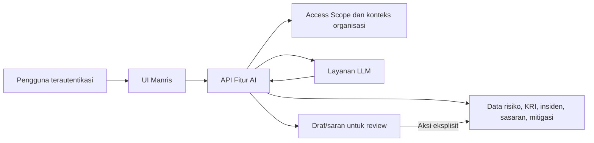
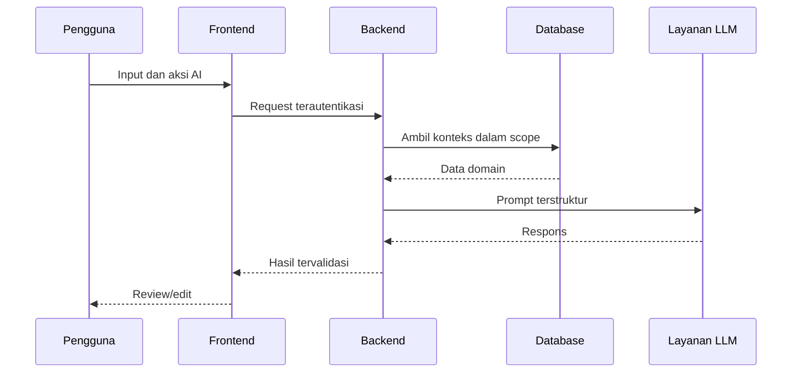

# Functional Specification Document

| Atribut Dokumen | Nilai |
|---|---|
| Proyek | Manris v2 |
| Aplikasi | Manris — AI-Driven Risk & Incident Management SaaS |
| Modul | Fitur AI |
| Versi | 1.0 |
| Status | Draft |
| Penulis | Tim Produk Manris |
| Tanggal | 2026-07-06 |

## Riwayat Revisi

| Versi | Tanggal | Penulis | Ringkasan Perubahan | Status |
|---|---|---|---|---|
| 1.0 | 2026-07-06 | Tim Produk Manris | Penyusunan awal FSD berdasarkan PRD dan implementasi aktual | Draft |

## Persetujuan Dokumen

| Role | Nama | Keputusan | Tanggal | Catatan |
|---|---|---|---|---|
| Product Owner | Belum ditetapkan | Pending | Belum ditetapkan | Menunggu review |
| Technical Lead | Belum ditetapkan | Pending | Belum ditetapkan | Menunggu review |

## 1. Pendahuluan (Introduction)

Manris v2 memerlukan bantuan AI untuk mempercepat analisis risiko dan insiden, mengubah materi rapat atau dokumen menjadi data terstruktur, serta membantu pengguna menyusun informasi risiko yang dapat ditinjau sebelum disimpan. Semua keluaran AI bersifat rekomendasi atau draf dan tetap memerlukan keputusan pengguna.

### 1.1 Tujuan Dokumen (Purpose of the Document)

Dokumen ini mendefinisikan perilaku fungsional, input, output, validasi, alur, integrasi, dan kebutuhan kualitas Fitur AI. Audiensnya adalah Product Owner, Business Analyst, developer, QA, security, dan operation.

### 1.2 Ruang Lingkup Proyek (Project Scope)

**In-scope**

- Analisis akar masalah Fishbone/Ishikawa.
- Pembuatan uraian dampak dan rekomendasi mitigasi.
- Analisis transkrip dan penerapan perubahan risiko hasil review pengguna.
- Pembuatan notulensi rapat terstruktur.
- Saran risiko berdasarkan konteks organisasi dan saran KRI.
- Ekstraksi insiden dari PDF dan pencocokan insiden dengan risiko.
- Document Intelligence untuk SOP, temuan audit, sasaran strategis, dan laporan mitigasi.
- Kontrol akses organisasi, konfigurasi model AI, validasi input, dan penanganan kegagalan.

**Out-of-scope**

- Penyimpanan otomatis keluaran AI tanpa review atau tindakan eksplisit pengguna.
- Pelatihan atau fine-tuning model bahasa.
- Penetapan keputusan manajemen risiko secara otonom oleh AI.
- OCR untuk dokumen hasil pemindaian yang tidak memiliki teks terbaca.

### 1.3 Ruang Lingkup Dokumen (Scope of the Document)

FSD membahas capability AI yang tersedia melalui API dan UI Manris v2, termasuk keterkaitannya dengan register risiko, insiden, KRI, organisasi, sasaran strategis, dan tugas mitigasi.

### 1.4 Dokumen Terkait (Related Documents)

| Komponen | Nama dan Tautan Dokumen | Deskripsi |
|---|---|---|
| PRD | [prd.md](prd.md) | Kebutuhan produk dan modul AI |
| API handler | [backend/internal/handler/http/ai.go](backend/internal/handler/http/ai.go) | Kontrak HTTP dan validasi request |
| Domain model | [backend/internal/domain/entity/ai.go](backend/internal/domain/entity/ai.go) | Struktur input dan output AI |
| Domain model dokumen | [backend/internal/domain/entity/ai_document.go](backend/internal/domain/entity/ai_document.go) | Mode dan hasil Document Intelligence |

### 1.5 Istilah, Akronim, dan Definisi (Terms/Acronyms and Definitions)

| Istilah/Akronim | Definisi | Deskripsi |
|---|---|---|
| AI | Artificial Intelligence | Kemampuan berbasis model bahasa untuk menghasilkan rekomendasi terstruktur |
| LLM | Large Language Model | Layanan model yang memproses prompt dan menghasilkan respons |
| Fishbone | Diagram Ishikawa | Pengelompokan akar penyebab dalam lima kategori |
| KRI | Key Risk Indicator | Indikator untuk memantau perubahan eksposur risiko |
| PIC | Person In Charge | Penanggung jawab action item |
| Access Scope | Cakupan akses | Organisasi yang boleh dibaca atau diproses oleh pengguna |
| Source Reference | Bukti sumber | Kutipan dan lokasi dokumen yang mendasari saran |

### 1.6 Risiko dan Asumsi (Risks and Assumptions)

#### Asumsi

| ID | Asumsi | Dasar | Dampak jika Tidak Valid | Pemilik |
|---|---|---|---|---|
| ASM-001 | Semua endpoint AI berada di belakang autentikasi aplikasi | Arsitektur JWT dan middleware proyek | Akses dan pengujian keamanan harus direvisi | Technical Lead |
| ASM-002 | Keluaran AI wajib direview sebelum diterapkan | Pola UI dan use case penerapan perubahan | Risiko data salah meningkat jika penerapan dibuat otomatis | Product Owner |
| ASM-003 | Status dokumen adalah Draft sampai pihak persetujuan memberi keputusan | Belum ada metadata persetujuan dari pengguna | Dokumen tidak boleh dianggap baseline final | Product Owner |

#### Risiko

| ID | Risiko | Kemungkinan | Dampak | Mitigasi | Pemilik |
|---|---|---|---|---|---|
| RSK-001 | AI menghasilkan informasi tidak akurat | High | High | Tampilkan sebagai saran, sertakan reasoning/bukti, dan wajibkan review | Product Owner |
| RSK-002 | Dokumen berisi data sensitif dikirim ke penyedia AI | Medium | High | Terapkan access scope, enkripsi transport, minimisasi data, dan kebijakan retensi | Security |
| RSK-003 | Format respons model tidak sesuai schema | Medium | Medium | Validasi, normalisasi, dan tampilkan kegagalan yang dapat ditindaklanjuti | Backend Team |
| RSK-004 | Dokumen tidak memiliki teks yang dapat diekstrak | Medium | Medium | Tolak sebagai dokumen tidak terbaca dan minta file yang sesuai | Backend Team |

## 2. Gambaran Umum Sistem/Solusi (System/Solution Overview)

Fitur AI menerima konteks dari pengguna dan data Manris, meneruskannya ke repository integrasi LLM, memvalidasi hasil terstruktur, lalu menyajikan draf kepada pengguna. Perubahan data domain hanya terjadi melalui aksi eksplisit dan aturan otorisasi aplikasi.

### 2.1 Diagram Konteks, Interface, Data Flow, Screen Flow, Sitemap, atau Process Flow



### 2.2 Aktor Sistem (System Actors)

#### 2.2.1 Role, Tanggung Jawab, dan Kewenangan

| User/Role | Contoh | Frekuensi Penggunaan | Security/Access dan Fitur | Catatan Tambahan |
|---|---|---|---|---|
| Super Admin | Administrator pusat | Occasional | Akses global dan konfigurasi model AI | Tetap terikat autentikasi |
| Unit | Pengelola risiko unit | Frequent | Menggunakan fitur AI pada organisasi yang dapat diakses | Review keluaran sebelum simpan |
| Reviewer | Penelaah risiko | Frequent | Menelaah saran dan perubahan sesuai scope | Penerapan perubahan mengikuti role yang diizinkan |
| Pimpinan | Pengambil keputusan | Occasional | Melihat hasil sesuai scope | Tidak menggantikan keputusan manusia |
| Layanan LLM | Sistem eksternal | On-demand | Memproses prompt terstruktur | Tidak memiliki kewenangan domain |

### 2.3 Dependency dan Dampak Perubahan (Dependencies and Change Impacts)

#### 2.3.1 System Dependencies

| ID | Sistem/Komponen | Jenis Dependency | Kebutuhan | Dampak Kegagalan | Pemilik |
|---|---|---|---|---|---|
| DEP-001 | Layanan LLM | API | Model tersedia dan kredensial valid | Generasi/analisis gagal | Operation |
| DEP-002 | PostgreSQL | Data | Konteks organisasi dan data domain dapat dibaca | Saran kontekstual gagal atau tidak lengkap | Backend Team |
| DEP-003 | JWT dan Access Scope | Auth | Identitas, role, dan cakupan organisasi tersedia | Request ditolak | Security |
| DEP-004 | Ekstraktor PDF/XLSX | Library | Teks dokumen dapat diekstrak | Analisis dokumen gagal | Backend Team |

#### 2.3.2 Change Impacts

| ID | Sistem/Proses Terdampak | Perubahan | Dampak | Tindakan yang Diperlukan | Pemilik |
|---|---|---|---|---|---|
| IMP-001 | Register risiko | Saran dapat membuat draf atau mengubah versi risiko | Data risiko dan audit trail bertambah | Uji otorisasi dan versioning | Risk Team |
| IMP-002 | Insiden | PDF dapat menghasilkan beberapa draf insiden | Input manual berkurang | Wajib review sebelum persistensi | Incident Team |
| IMP-003 | KRI dan mitigasi | AI memberi saran struktur data | Pengguna memperoleh prefill | Validasi domain tetap berlaku | Product Owner |

## 3. Functional Specifications

Spesifikasi dikelompokkan berdasarkan capability.

### 3.0 Indeks Fungsi dan Traceability

| Function ID | Nama Fungsi | Business Requirement | Use Case | Functional Requirement | Test Case | Prioritas |
|---|---|---|---|---|---|---|
| FN-001 | Analisis risiko inline | BR-001 | UC-001 | FR-001–FR-006 | TC-001 | High |
| FN-002 | Analisis transkrip | BR-002 | UC-002 | FR-007–FR-012 | TC-002 | High |
| FN-003 | Notulensi rapat | BR-003 | UC-003 | FR-013–FR-015 | TC-003 | Medium |
| FN-004 | Saran risiko dan KRI | BR-004 | UC-004 | FR-016–FR-019 | TC-004 | Medium |
| FN-005 | AI untuk insiden | BR-005 | UC-005 | FR-020–FR-025 | TC-005 | High |
| FN-006 | Document Intelligence | BR-006 | UC-006 | FR-026–FR-032 | TC-006 | High |

### 3.1 Analisis Risiko Inline

#### 3.1.1 Tujuan/Deskripsi (Purpose/Description)

Membantu pengguna menghasilkan akar masalah, dampak, dan tindakan mitigasi dari judul serta deskripsi risiko.

#### 3.1.2 Use Case

##### UC-001 — Menghasilkan Analisis Risiko

| Elemen | Deskripsi |
|---|---|
| Primary Actor(s) | Unit, Reviewer |
| Stakeholders and Interest | Risk owner memerlukan draf yang cepat dan dapat diedit |
| Trigger | Pengguna menekan aksi AI pada form risiko |
| Pre-conditions | Pengguna terautentikasi; judul dan deskripsi terisi |
| Post-conditions | Saran ditampilkan; data domain belum berubah sampai pengguna menyimpan |
| Priority | High |
| Special Requirements | Konteks organisasi harus mengikuti Access Scope |
| Open Questions | Tidak Ada |

**Main Success Scenario**

1. Pengguna mengisi judul dan deskripsi.
2. Pengguna memilih analisis akar masalah, dampak, atau mitigasi.
3. Sistem memvalidasi input dan mengirim konteks organisasi ke layanan AI.
4. Sistem menampilkan hasil yang dapat direview dan diedit.

**Extensions/Alternative and Error Flows**

| Ref. Langkah | Kondisi | Alternative/Error Steps | Hasil |
|---|---|---|---|
| 3a | Judul/deskripsi kosong | Sistem menolak request | Tidak ada panggilan AI |
| 3b | Layanan AI gagal | Sistem mengembalikan error terstruktur | Data form dipertahankan |

#### 3.1.3 Mock-up

```text
+--------------------------------------------------+
| Form Risiko                                      |
+--------------------------------------------------+
| (1) Judul                                        |
| (2) Deskripsi                                    |
| [3: Generate Fishbone] [4: Generate Impact]      |
| (5) Penyebab terpilih  [6: Generate Mitigation]  |
| (7) Area hasil yang dapat diedit                 |
+--------------------------------------------------+
```

#### 3.1.4 Functional Requirements

| Spec ID | Specification Description | Business Rules/Data Dependency |
|---|---|---|
| FR-001 | Sistem harus mewajibkan judul dan deskripsi untuk generasi analisis risiko. | Validasi `AIRequest` |
| FR-002 | Sistem harus mengelompokkan Fishbone ke Manusia, Metode, Mesin, Material, dan Lingkungan. | Lima kategori tetap |
| FR-003 | Sistem harus menghasilkan uraian dampak sebagai teks. | Judul dan deskripsi |
| FR-004 | Sistem harus menerima penyebab dan dampak sebagai konteks opsional mitigasi. | Judul dan deskripsi tetap wajib |
| FR-005 | Sistem harus menghasilkan rekomendasi mitigasi sebagai daftar tindakan. | Layanan LLM |
| FR-006 | Sistem harus mengizinkan pengguna mereview dan mengubah hasil sebelum penyimpanan form. | UI form risiko |

#### 3.1.5 Field-Level Specifications

##### Form Elements

| Call-out | Field Label | UI Control | Mandatory? | Editable? | Data Type | Value Set | Default Value | Data Example | Data Source |
|---|---|---|---|---|---|---|---|---|---|
| 1 | Judul | Textbox | Ya | Ya | String | Teks | Kosong | Gangguan rantai dingin | User |
| 2 | Deskripsi | Textarea | Ya | Ya | String | Teks | Kosong | Suhu penyimpanan tidak stabil | User |
| 5 | Penyebab | Textarea/select | Kondisional | Ya | String | Teks | Kosong | Kalibrasi terlambat | User/Fishbone |
| 7 | Hasil | Structured editor | Tidak | Ya | Object/string/list | Sesuai jenis analisis | Kosong | Saran AI | AI |

##### Form Business Rules and Dependencies

| Field Label | Validation/Business Rules | Error Messages | Data Dependencies | Additional Info/Notes |
|---|---|---|---|---|
| Judul | Tidak boleh kosong | “Judul tidak valid” | Tidak Ada | Wajib untuk semua analisis inline |
| Deskripsi | Tidak boleh kosong | “Deskripsi tidak valid” | Tidak Ada | Wajib untuk semua analisis inline |
| Hasil | Harus sesuai schema capability | Error layanan terstruktur | Layanan LLM | Tidak disimpan otomatis |

##### Buttons, Links, and Icons

| Button/Link/Icon Label | OnClick Event | Other Event | Visible | Enabled vs Disabled | Navigate To | Validation | Dependencies |
|---|---|---|---|---|---|---|---|
| Generate Fishbone | POST `/api/v1/ai/causes` | Loading state | Pada form terkait | Aktif bila input wajib terisi | NA | Judul, deskripsi | LLM |
| Generate Impact | POST `/api/v1/ai/impacts` | Loading state | Pada form terkait | Aktif bila input wajib terisi | NA | Judul, deskripsi | LLM |
| Generate Mitigation | POST `/api/v1/ai/mitigations` | Loading state | Pada form terkait | Aktif bila input wajib terisi | NA | Judul, deskripsi | LLM |

### 3.2 Analisis Transkrip

#### 3.2.1 Tujuan/Deskripsi (Purpose/Description)

Mengidentifikasi risiko baru atau perubahan risiko dari transkrip dan menyediakan perubahan granular yang dapat dipilih.

#### 3.2.2 Use Case

##### UC-002 — Menganalisis dan Menerapkan Saran Transkrip

| Elemen | Deskripsi |
|---|---|
| Primary Actor(s) | Unit, Reviewer |
| Stakeholders and Interest | Risk owner memerlukan bukti dan kontrol atas perubahan |
| Trigger | Pengguna mengirim transkrip untuk dianalisis |
| Pre-conditions | Pengguna terautentikasi; transkrip tidak kosong |
| Post-conditions | Saran tersedia; perubahan terpilih diterapkan sesuai status/versioning risiko |
| Priority | High |
| Special Requirements | Target harus berada dalam scope; actor ID dan role harus valid |
| Open Questions | Tidak Ada |

**Main Success Scenario**

1. Pengguna menempelkan transkrip dan memilih Analyze.
2. Sistem menghasilkan saran beserta kutipan, reasoning, confidence, kandidat risiko, dan perubahan.
3. Pengguna memilih target dan perubahan yang disetujui.
4. Sistem memvalidasi role, scope, target, dan perubahan.
5. Sistem memperbarui draf atau membuat versi baru untuk risiko yang telah disetujui.

**Extensions/Alternative and Error Flows**

| Ref. Langkah | Kondisi | Alternative/Error Steps | Hasil |
|---|---|---|---|
| 2a | Tidak ada saran | Sistem menampilkan hasil kosong | Tidak ada perubahan |
| 4a | Target di luar scope | Sistem menolak dengan forbidden | Data tidak berubah |
| 5a | Field perubahan tidak didukung | Sistem menolak input | Data tidak berubah |

#### 3.2.3 Mock-up

```text
+--------------------------------------------------+
| Transcript Analyzer                              |
| (1) Transkrip                         [2 Analyze] |
| (3) Saran: target, kutipan, reasoning, confidence|
| (4) [x] Perubahan terpilih           [5 Terapkan]|
+--------------------------------------------------+
```

#### 3.2.4 Functional Requirements

| Spec ID | Specification Description | Business Rules/Data Dependency |
|---|---|---|
| FR-007 | Sistem harus menolak transkrip kosong. | Validasi use case |
| FR-008 | Sistem harus mengembalikan saran terkelompok untuk target risiko baru atau existing. | Data risiko dalam scope |
| FR-009 | Setiap saran harus dapat memuat kutipan, reasoning, confidence, kandidat, dan perubahan granular. | Schema `TranscriptSuggestion` |
| FR-010 | Sistem harus menerapkan hanya perubahan yang dipilih pengguna. | `selectedChanges` |
| FR-011 | Sistem harus memperbarui risiko draft tanpa membuat versi pengganti. | Status risiko |
| FR-012 | Sistem harus membuat versi baru dan mengarsipkan versi lama ketika target telah disetujui. | Versioning risiko |

#### 3.2.5 Field-Level Specifications

Tabel field utama: Transkrip (textarea, wajib, editable, sumber user), Target Risk ID (UUID, wajib saat apply), dan Selected Changes (array, wajib saat apply). Tombol Analyze memanggil `/api/v1/ai/transcripts`; tombol Terapkan memanggil `/api/v1/ai/transcripts/apply-risk-change` dan hanya aktif setelah target serta minimal satu perubahan valid dipilih.

### 3.3 Notulensi Rapat

#### 3.3.1 Tujuan/Deskripsi (Purpose/Description)

Mengubah transkrip mentah menjadi notulensi terstruktur.

#### 3.3.2 Use Case

##### UC-003 — Menghasilkan Notulensi

| Elemen | Deskripsi |
|---|---|
| Primary Actor(s) | Semua role pengguna |
| Stakeholders and Interest | Peserta rapat membutuhkan catatan dan tindak lanjut |
| Trigger | Pengguna mengirim transkrip |
| Pre-conditions | Terautentikasi; transkrip tidak kosong |
| Post-conditions | Notulensi terstruktur ditampilkan untuk review |
| Priority | Medium |
| Special Requirements | Hasil tidak boleh dianggap final tanpa review |
| Open Questions | Mekanisme retensi notulensi perlu dikonfirmasi |

**Main Success Scenario**

1. Pengguna memasukkan transkrip.
2. Sistem memvalidasi dan memproses transkrip.
3. Sistem menampilkan judul, tanggal, peserta, agenda, ringkasan, poin penting, keputusan, isu, action item, dan next check-in.
4. Pengguna mereview hasil.

**Extensions/Alternative and Error Flows**

| Ref. Langkah | Kondisi | Alternative/Error Steps | Hasil |
|---|---|---|---|
| 2a | Transkrip kosong/tidak dapat diproses | Sistem menampilkan error | Tidak ada hasil baru |

#### 3.3.3 Mock-up

Tidak Berlaku sebagai mock-up final; implementasi memakai halaman pembuatan dan daftar/detail notulensi.

#### 3.3.4 Functional Requirements

| Spec ID | Specification Description | Business Rules/Data Dependency |
|---|---|---|
| FR-013 | Sistem harus menghasilkan struktur `MeetingMinutes` dari transkrip. | POST `/api/v1/ai/minutes` |
| FR-014 | Action item harus dapat memuat task, PIC, unit, deadline, priority, status, notes, keputusan terkait, dan kebutuhan konfirmasi. | Schema domain |
| FR-015 | Sistem harus menampilkan hasil untuk review sebelum dianggap notulensi final. | UI |

#### 3.3.5 Field-Level Specifications

Transkrip adalah textarea wajib dan editable. Hasil adalah object terstruktur dari AI. Tombol Generate hanya aktif bila transkrip tidak kosong.

### 3.4 Saran Risiko dan KRI

#### 3.4.1 Tujuan/Deskripsi (Purpose/Description)

Memberi saran risiko berdasarkan data organisasi yang dapat diakses dan menyusun kandidat KRI dari konteks risiko.

#### 3.4.2 Use Case

##### UC-004 — Menghasilkan Saran Risiko atau KRI

| Elemen | Deskripsi |
|---|---|
| Primary Actor(s) | Unit, Reviewer |
| Stakeholders and Interest | Organisasi membutuhkan identifikasi risiko dan indikator yang konsisten |
| Trigger | Pengguna meminta saran |
| Pre-conditions | Access Scope tersedia; untuk KRI judul dan deskripsi terisi |
| Post-conditions | Daftar saran ditampilkan tanpa penyimpanan otomatis |
| Priority | Medium |
| Special Requirements | Data organisasi harus dibatasi sesuai scope |
| Open Questions | Tidak Ada |

**Main Success Scenario**

1. Pengguna memilih fungsi saran.
2. Sistem mengambil konteks yang diizinkan.
3. Sistem menghasilkan daftar saran.
4. Pengguna memilih atau mengedit saran.

**Extensions/Alternative and Error Flows**

| Ref. Langkah | Kondisi | Alternative/Error Steps | Hasil |
|---|---|---|---|
| 2a | Scope tidak tersedia | Sistem menolak request | Tidak ada data terekspos |

#### 3.4.3 Mock-up

Tidak Berlaku; fungsi digunakan sebagai prefill pada layar domain terkait.

#### 3.4.4 Functional Requirements

| Spec ID | Specification Description | Business Rules/Data Dependency |
|---|---|---|
| FR-016 | Sistem harus membatasi konteks saran risiko ke organisasi dalam Access Scope. | Repository risiko |
| FR-017 | Saran risiko harus memuat title, description, dan category. | Schema domain |
| FR-018 | Saran KRI harus memuat name, description, metric, threshold minimum/maksimum, direction, dan frequency. | Schema domain |
| FR-019 | Sistem harus mewajibkan judul dan deskripsi untuk generasi KRI. | POST `/api/v1/ai/kris` |

#### 3.4.5 Field-Level Specifications

Saran risiko tidak memerlukan body pengguna; konteks berasal dari scope. Generasi KRI memakai Judul dan Deskripsi wajib. Semua hasil editable setelah dipilih sebagai prefill.

### 3.5 AI untuk Insiden

#### 3.5.1 Tujuan/Deskripsi (Purpose/Description)

Mengekstrak satu atau beberapa draf insiden dari PDF dan menyarankan hubungan risiko untuk insiden manual.

#### 3.5.2 Use Case

##### UC-005 — Mengekstrak atau Mencocokkan Insiden

| Elemen | Deskripsi |
|---|---|
| Primary Actor(s) | Unit |
| Stakeholders and Interest | Pengelola insiden memerlukan input cepat tetapi terkontrol |
| Trigger | Upload PDF atau permintaan saran risiko pada form manual |
| Pre-conditions | File PDF maksimum 10 MB atau data insiden manual tersedia |
| Post-conditions | Draf insiden dan saran risiko ditampilkan; belum dipersistenkan |
| Priority | High |
| Special Requirements | Organisasi harus valid dan diizinkan |
| Open Questions | Tidak Ada |

**Main Success Scenario**

1. Pengguna mengunggah PDF atau mengisi data insiden.
2. Sistem memvalidasi file/data dan mengekstrak teks bila diperlukan.
3. Sistem menghasilkan draf insiden dan kandidat risiko.
4. Sistem menampilkan missing fields, warnings, confidence, dan source preview.
5. Pengguna mereview sebelum menyimpan melalui proses insiden.

**Extensions/Alternative and Error Flows**

| Ref. Langkah | Kondisi | Alternative/Error Steps | Hasil |
|---|---|---|---|
| 2a | File bukan PDF | Sistem menolak file | Tidak ada pemrosesan |
| 2b | File lebih dari 10 MB | Sistem mengembalikan 413 | Tidak ada pemrosesan |
| 2c | Teks tidak terbaca | Sistem menampilkan error dokumen | Tidak ada draf |

#### 3.5.3 Mock-up

```text
+--------------------------------------------------+
| Import Insiden                                   |
| (1) File PDF  (2) Organisasi        [3 Ekstrak]  |
| (4) Draf insiden | warning | confidence          |
| (5) Kandidat risiko                  [6 Review]   |
+--------------------------------------------------+
```

#### 3.5.4 Functional Requirements

| Spec ID | Specification Description | Business Rules/Data Dependency |
|---|---|---|
| FR-020 | Sistem harus menerima hanya PDF maksimum 10 MB untuk ekstraksi batch. | Multipart `file` |
| FR-021 | Sistem harus mengekstrak satu atau beberapa `IncidentExtractionItem`. | Teks PDF |
| FR-022 | Draf harus dapat memuat 5W1H, severity, corrective action, dan preventive action. | Schema `IncidentDraft` |
| FR-023 | Setiap item harus memuat client key, missing fields, warnings, dan confidence. | Schema domain |
| FR-024 | Saran risiko harus memuat ID, kode, judul, reason, dan confidence. | Data risiko |
| FR-025 | Sistem tidak boleh menyimpan draf insiden secara otomatis. | Review pengguna |

#### 3.5.5 Field-Level Specifications

File wajib, tipe PDF, maksimal 10 MB. Organization ID opsional berupa UUID. Untuk saran manual, Title, What, Who, When, Where, Why/How, Severity, dan Organization ID menjadi konteks; validasi wajib mengikuti use case dan domain insiden.

### 3.6 Document Intelligence

#### 3.6.1 Tujuan/Deskripsi (Purpose/Description)

Menganalisis PDF/XLSX dalam salah satu mode bisnis dan memetakan hasil terhadap data Manris.

#### 3.6.2 Use Case

##### UC-006 — Menganalisis Dokumen

| Elemen | Deskripsi |
|---|---|
| Primary Actor(s) | Super Admin, Unit, Reviewer |
| Stakeholders and Interest | Pemilik proses membutuhkan saran berbukti dari dokumen |
| Trigger | Pengguna mengunggah dokumen dan memilih mode |
| Pre-conditions | PDF/XLSX maksimum 10 MB; mode valid; Access Scope tersedia |
| Post-conditions | Metadata dokumen dan hasil mode-spesifik ditampilkan |
| Priority | High |
| Special Requirements | Source reference harus dipertahankan; scope organisasi wajib divalidasi |
| Open Questions | Kebijakan retensi file sumber belum ditetapkan |

**Main Success Scenario**

1. Pengguna memilih mode, file, organisasi opsional, dan periode opsional.
2. Sistem memvalidasi file, mode, UUID organisasi, serta scope.
3. Sistem mengekstrak teks dan mengambil konteks domain yang relevan.
4. Sistem menjalankan analisis AI dan menormalisasi hasil.
5. Sistem menampilkan filename, text length, warning ekstraksi, dan hasil.

**Extensions/Alternative and Error Flows**

| Ref. Langkah | Kondisi | Alternative/Error Steps | Hasil |
|---|---|---|---|
| 2a | Mode tidak dikenal | Sistem menolak request | Tidak ada analisis |
| 2b | Organisasi di luar scope | Sistem mengembalikan forbidden | Tidak ada data terekspos |
| 3a | Dokumen kosong/tidak terbaca | Sistem menolak dokumen | Tidak ada panggilan AI |

#### 3.6.3 Mock-up

```text
+--------------------------------------------------+
| Document Intelligence                            |
| (1) Mode (2) File PDF/XLSX (3) Organisasi        |
| (4) Periode                         [5 Analisis]  |
| (6) Warning ekstraksi                            |
| (7) Hasil dan source references                  |
+--------------------------------------------------+
```

#### 3.6.4 Functional Requirements

| Spec ID | Specification Description | Business Rules/Data Dependency |
|---|---|---|
| FR-026 | Sistem harus menerima PDF atau XLSX maksimum 10 MB. | Multipart |
| FR-027 | Sistem harus mewajibkan salah satu mode: SOP risk universe, audit finding mapper, strategic objective risk, atau mitigation report mapper. | Enum domain |
| FR-028 | Sistem harus memvalidasi organisasi terhadap Access Scope. | Middleware |
| FR-029 | Sistem harus mengambil konteks risiko untuk mode SOP dan audit. | Repository risiko |
| FR-030 | Sistem harus mengambil sasaran strategis dan risiko untuk mode sasaran strategis. | Repository planning/risk |
| FR-031 | Sistem harus mengirim hanya tugas mitigasi terbuka untuk mode laporan mitigasi. | Repository mitigation task |
| FR-032 | Sistem harus mengembalikan source reference berupa quote dan location bila tersedia. | Hasil AI |

#### 3.6.5 Field-Level Specifications

| Call-out | Field Label | UI Control | Mandatory? | Editable? | Data Type | Value Set | Default Value | Data Example | Data Source |
|---|---|---|---|---|---|---|---|---|---|
| 1 | Mode | Select | Ya | Ya | Enum | Empat mode yang didukung | Kosong | `sop_risk_universe` | User |
| 2 | File | File input | Ya | Ya | Binary | PDF/XLSX, ≤10 MB | Kosong | SOP.pdf | User |
| 3 | Organisasi | Select | Kondisional | Ya | UUID | Organisasi dalam scope | Scope aktif | UUID | Database |
| 4 | Periode | Text/select | Tidak | Ya | String | Teks periode | Kosong | 2026-H1 | User |
| 7 | Hasil | Structured view | Tidak | Tidak | Object | Sesuai mode | Kosong | Saran dan bukti | AI |

##### Form Business Rules and Dependencies

| Field Label | Validation/Business Rules | Error Messages | Data Dependencies | Additional Info/Notes |
|---|---|---|---|---|
| File | Wajib; ekstensi PDF/XLSX; maksimum 10 MB | “file wajib diisi”, “hanya file PDF dan XLSX yang didukung” | Ekstraktor dokumen | File tidak disimpan oleh endpoint analisis |
| Mode | Wajib dan harus ada dalam enum | “mode analisis dokumen tidak valid” | Tidak Ada | Menentukan konteks domain |
| Organisasi | UUID valid dan berada dalam scope | “ID organisasi tidak valid” / “izin tidak mencukupi” | Access Scope | Global scope dapat memilih organisasi |

##### Buttons, Links, and Icons

| Button/Link/Icon Label | OnClick Event | Other Event | Visible | Enabled vs Disabled | Navigate To | Validation | Dependencies |
|---|---|---|---|---|---|---|---|
| Analisis | POST `/api/v1/ai/document-intelligence/analyze` | Progress/loading | Halaman Document Intelligence | Aktif bila file dan mode valid | NA | File, mode, organisasi | Extractor, DB, LLM |

## 4. Konfigurasi Sistem (System Configurations)

| Config ID | Nama Konfigurasi | Tujuan | Nilai/Alternatif | Kondisi/Dependency | Pemilik |
|---|---|---|---|---|---|
| CFG-001 | API key penyedia AI | Autentikasi layanan LLM | Secret environment | Wajib untuk fitur aktif | Operation |
| CFG-002 | Model default | Fallback model AI | Model yang didukung provider | Digunakan bila model fitur kosong | Super Admin |
| CFG-003 | Model per fitur | Memilih model sesuai capability | Cause, impact, mitigation, transcript, minutes, KRI, risk suggestion, incident | Dikelola lewat system settings | Super Admin |
| CFG-004 | AI feature capability | Mengaktifkan/menonaktifkan UI AI | Enabled/disabled | Environment frontend | Operation |
| CFG-005 | Batas upload | Mencegah payload berlebih | 10 MB | Handler upload | Backend Team |

## 5. Kebutuhan Sistem Lain/Non-Functional Requirements

| NFR ID | Kategori | Requirement Terukur | Target/SLA | Cara Verifikasi | Catatan |
|---|---|---|---|---|---|
| NFR-001 | Security | Semua request harus diautentikasi dan data organisasi dibatasi sesuai Access Scope | 100% endpoint terproteksi | Integration test | Asumsi autentikasi perlu diverifikasi pada registrasi route |
| NFR-002 | Security | Secret penyedia AI tidak boleh dikirim ke browser atau dicatat dalam log | 0 kebocoran secret | Review konfigurasi/log | Wajib |
| NFR-003 | Data integrity | Penerapan perubahan harus atomik dan gagal tanpa perubahan parsial | 100% rollback saat error | Transaction test | Khusus apply perubahan |
| NFR-004 | File safety | Upload harus dibatasi tipe dan ukuran sebelum analisis | 100% file invalid ditolak | Handler test | Maksimum 10 MB |
| NFR-005 | Auditability | Perubahan risiko dari transkrip harus mempertahankan actor dan versioning | 100% perubahan terlacak | Repository/integration test | Selaras audit trail |
| NFR-006 | Performance | Target response time dan timeout layanan AI harus ditetapkan sebelum production approval | Belum ditetapkan | Load test | ISSUE-001 |
| NFR-007 | Availability | UI harus menampilkan kegagalan tanpa menghapus input pengguna | 100% skenario error utama | UI test | Graceful degradation |
| NFR-008 | Accessibility | Kontrol AI harus dapat dioperasikan dengan keyboard dan memiliki label | WCAG 2.1 AA | Accessibility audit | UI |

## 6. Reporting Requirements

Tidak Berlaku. Capability dalam FSD ini menghasilkan hasil analisis/draf pada layar dan tidak mendefinisikan laporan terjadwal atau file laporan khusus.

## 7. Integration Requirements

| INT ID | Sistem Sumber | Sistem Target | Interface/Protocol | Direction | Trigger/Frequency | Data Utama | Security | SLA/Timeout |
|---|---|---|---|---|---|---|---|---|
| INT-001 | Backend Manris | Layanan LLM | HTTPS API | Bidirectional | On-demand | Prompt, konteks organisasi/domain, respons terstruktur | API key dan TLS | Belum ditetapkan |
| INT-002 | Frontend Manris | Backend Manris | REST/JSON atau multipart | Bidirectional | Aksi pengguna | Input capability dan hasil AI | JWT/TLS | Mengikuti API aplikasi |
| INT-003 | Backend Manris | PostgreSQL | pgx | Bidirectional | Sesuai capability | Risiko, organisasi, sasaran, mitigasi, versioning | Koneksi DB terproteksi | Mengikuti database aplikasi |



### 7.1 Exception Handling/Error Reporting

| Exception/Error ID | Error | Cause | Solution Strategy |
|---|---|---|---|
| ERR-001 | Bad request | Body, UUID, mode, atau field tidak valid | Tolak 400 dengan Problem Details |
| ERR-002 | Unauthorized | Identitas/role tidak tersedia | Tolak 401 dan minta login ulang |
| ERR-003 | Forbidden | Scope tidak tersedia atau organisasi tidak diizinkan | Tolak 403 tanpa membocorkan data |
| ERR-004 | File terlalu besar | Ukuran di atas 10 MB | Tolak 413 sebelum ekstraksi |
| ERR-005 | Tipe file tidak didukung | Ekstensi/MIME tidak sesuai | Tolak 400 |
| ERR-006 | Dokumen tidak terbaca | Ekstraksi menghasilkan teks kosong/gagal | Minta dokumen dengan teks terbaca |
| ERR-007 | Layanan AI gagal atau respons invalid | Timeout, provider error, schema mismatch | Log correlation ID, jangan ubah data, tampilkan error aman |

Retry otomatis dan timeout provider belum ditetapkan. Operasi penerapan perubahan tidak boleh diulang tanpa kontrol idempotensi/rekonsiliasi karena dapat membuat versi ganda.

## 8. Data Migration/Conversion Requirements

Tidak Berlaku. Fitur AI memproses input on-demand dan tidak memerlukan migrasi dataset historis.

### 8.1 Data Conversion Strategy

Tidak Berlaku karena tidak ada cutover atau ETL.

### 8.2 Data Conversion Preparation

Tidak Berlaku karena tidak ada sumber data legacy yang dikonversi.

### 8.3 Data Conversion Specifications

Tidak Berlaku karena tidak ada mapping migrasi.

## 9. Referensi (References)

| Ref. ID | Referensi | Tautan/Versi | Penggunaan |
|---|---|---|---|
| REF-001 | Product Requirements Document | `prd.md`, working tree 2026-07-06 | Tujuan dan alur produk |
| REF-002 | AI HTTP Handler | `backend/internal/handler/http/ai.go`, working tree 2026-07-06 | Endpoint, request, file validation |
| REF-003 | AI Domain Entity | `backend/internal/domain/entity/ai.go`, working tree 2026-07-06 | Schema hasil |
| REF-004 | Document Intelligence Entity/Use Case | `backend/internal/domain/entity/ai_document.go` dan `backend/internal/usecase/ai/document_intelligence.go` | Mode, context, normalisasi |
| REF-005 | Transcript Apply Use Case | `backend/internal/usecase/ai/apply_risk_change.go` | Otorisasi dan versioning |

## 10. Open Issues

| Issue ID | Issue | Raised By | Raised On | Solution/Decision | Resolved By | Resolved On | Status |
|---|---|---|---|---|---|---|---|
| ISSUE-001 | Target response time, timeout provider, dan retry policy belum ditetapkan | Tim Produk Manris | 2026-07-06 | Belum Diputuskan | NA | NA | Open |
| ISSUE-002 | Kebijakan retensi prompt, hasil AI, file sumber, dan log provider belum ditetapkan | Tim Produk Manris | 2026-07-06 | Belum Diputuskan | NA | NA | Open |
| ISSUE-003 | Role yang diizinkan menerapkan perubahan transkrip perlu dibaseline-kan dalam requirement bisnis | Tim Produk Manris | 2026-07-06 | Mengikuti validasi use case saat ini sampai keputusan formal | NA | NA | Open |
| ISSUE-004 | Status penyimpanan notulensi antara kebutuhan PRD dan alur endpoint AI perlu diverifikasi end-to-end | Tim Produk Manris | 2026-07-06 | Belum Diputuskan | NA | NA | Open |

## Lampiran (Appendix)

### A. Traceability Matrix Lengkap

| Business Requirement | Use Case | Functional Requirement | Non-Functional Requirement | Test Case | Status |
|---|---|---|---|---|---|
| BR-001 Mempercepat penyusunan analisis risiko | UC-001 | FR-001–FR-006 | NFR-001, NFR-007 | TC-001 Validasi input dan schema hasil | Covered |
| BR-002 Mengubah transkrip menjadi perubahan risiko terkontrol | UC-002 | FR-007–FR-012 | NFR-003, NFR-005 | TC-002 Analisis, scope, apply, versioning | Covered |
| BR-003 Menghasilkan notulensi terstruktur | UC-003 | FR-013–FR-015 | NFR-007 | TC-003 Struktur dan error transkrip | Covered |
| BR-004 Memberi saran risiko dan KRI | UC-004 | FR-016–FR-019 | NFR-001 | TC-004 Scope dan schema saran | Covered |
| BR-005 Mempercepat input insiden | UC-005 | FR-020–FR-025 | NFR-004 | TC-005 File, ekstraksi, review | Covered |
| BR-006 Memetakan dokumen ke konteks risiko | UC-006 | FR-026–FR-032 | NFR-001, NFR-004 | TC-006 Empat mode, scope, bukti | Covered |

### B. Data Dictionary

| Data Element | Definisi | Tipe/Format | Allowed Values | Source of Truth | Classification | Retention |
|---|---|---|---|---|---|---|
| Organization ID | Organisasi konteks analisis | UUID | Organisasi dalam Access Scope | PostgreSQL | Internal | Mengikuti data organisasi |
| Transcript | Teks rapat sumber analisis | String | Teks non-kosong | Input pengguna | Confidential | Belum ditetapkan |
| Confidence | Keyakinan saran AI | Integer | 0–100 | Layanan AI | Internal | Mengikuti hasil AI |
| Source Reference | Bukti saran dari dokumen | Object | Quote dan location | Dokumen/AI | Confidential | Belum ditetapkan |
| Selected Changes | Perubahan risiko yang disetujui pengguna | Array object | Field/operation yang didukung | Review pengguna | Internal | Mengikuti audit/versioning risiko |
| Incident Draft | Kandidat insiden sebelum persistensi | Object | Field insiden terstruktur | Layanan AI | Confidential | Belum ditetapkan |
| Document Mode | Tujuan analisis dokumen | Enum | Empat mode pada FR-027 | Domain application | Internal | Tidak Berlaku |

### C. Supporting Diagrams dan Mock-ups

Diagram konteks, sequence integration, dan wireframe konseptual telah ditempatkan pada bagian 2, 3, dan 7. Tidak ada mock-up final tambahan.
